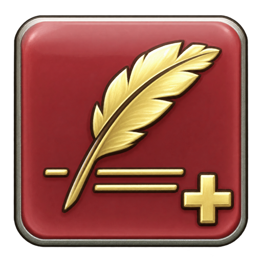

# MoreMacros



Extra macro pages beside **Individual** and **Shared** in FFXIV's User Macros window. Save more macros and use them from the game's existing hotbars without using any Individual or Shared macro slots.

Built for the international client, including Japanese servers, with an English interface. Requires Dalamud API 15.

## Features

- Extra pages of 100 macros, with names, tags, search, and an icon picker.
- Links on empty native hotbar slots; existing occupied slots are refused.
- Auto-translate phrase selection with **Tab**, preserving the game's phrase payloads.
- `/micon` and `/macroicon` images, including auto-translated action names.
- Read-only import from Individual and Shared pages, plus library backup export.
- Right-click menus for copying, executing, and deleting macros or pages.

## Install

MoreMacros and [XIV AI Chat](https://github.com/kuchris/xivaichat) use one custom plugin repository URL:

```text
https://raw.githubusercontent.com/kuchris/DalamudPlugins/main/repo.json
```

In `/xlsettings` → **Experimental** → **Custom Plugin Repositories**, add this URL and save. Open `/xlplugins`, find **MoreMacros**, and install it. This URL also includes XIV AI Chat.

If you previously subscribed through `xivaichat/main/repo.json`, replace that repository URL with the one above and refresh the installer. Keep your installed plugins and settings.

Open **User Macros** and click **MoreMacros** beside Shared, or enter `/moremacros`.

## Editing and hotbars

1. Use **+** to add a page and select an empty slot.
2. Enter a name and commands, choose an icon, then **Save**.
3. Unlock a visible normal hotbar and drag the macro to an empty cell. Alternatively, use **Place on hotbar...** to choose hotbar 1–10 and slot 1–12.

The plugin uses the game's macro runner, so normal timing and the 15-line limit apply. Editing a macro keeps its hotbar links. Deleting it leaves an unavailable link; its ID is never reused for a different macro. **Remove MoreMacros link** clears only a plugin link and keeps the saved macro.

In **Commands**, type a phrase and press **Tab** to search auto-translate. Use Up/Down and Enter, or click a result. Insert phrases through this picker: copying the visible brackets from elsewhere does not copy their metadata. Read-only imports from native pages retain supported phrase payloads.

A saved `/micon` or `/macroicon` command sets the grid and hotbar image. Removing the command, or using an unresolved icon, restores the manually chosen icon. Native recast, MP, charge, and proc indicators are not mirrored.

Switching pages or slots saves a valid draft. Invalid text stays in the editor; unloading discards unsaved edits.

## Storage and recovery

The library is normally stored at `%APPDATA%/XIVLauncher/pluginConfigs/MoreMacros/library.json`. Each successful replacement keeps the previous file as `library.json.bak`. **Export backup** writes a timestamped copy under `exports/`.

Back up the whole library: macro and hotbar link IDs belong together. Libraries from versions 1 and 2 are upgraded to format 3 on save, preserving the previous file as `.bak`. Older plugin versions cannot read format 3.

If loading fails, the source file is preserved and editing is disabled. Unload the plugin, keep a copy of the damaged file, restore a known-good export or `.bak` as `library.json`, and reload.

Before placing a hotbar link, the plugin saves a record under `hotbar-link-backups/`. It does not write to Individual or Shared macro banks. Links need MoreMacros enabled to execute.

## Current limits

This is an early release with native game integration. Placement and execution have been confirmed in-game, along with removal of the unwanted icon pulse and the Earthly Star `/micon` image. Cross hotbars are not supported for placement. Persistence across relog/job changes, native dragging of existing links, auto-translate chat output, and interactions with other plugins still need further live verification.

The editor is an overlay following the native User Macros window. It does not add native macro storage.

## Build and test

Requirements: Windows, the .NET 10 SDK, and matching Dalamud API 15 development assemblies under `%APPDATA%/XIVLauncher/addon/Hooks/dev/`. The plugin project also accepts the SDK's `DALAMUD_HOME` override.

```powershell
./build.ps1
./test.ps1
```

The package is written to `artifacts/MoreMacros-<version>.zip`, with a development copy in `artifacts/plugin/`. To load that copy, add the absolute path to `artifacts/plugin/MoreMacros.dll` under Dalamud's **Dev Plugin Locations**, then enable it in `/xlplugins`. Keep the packaged dependencies beside the DLL. `register-local.ps1` can register the path with the game closed; it backs up the launcher's settings first.

The offline suite covers storage and recovery, stable link IDs, native PvE/PvP call arguments, icon resolution, auto-translate encoding, and real ImGui input. These checks do not replace live game testing.

Optional development tools:

- `tools/inspect_hotbar.py --exe <ffxiv_dx11.exe> --client-structs <source directory containing FFXIV/Client>` reads selected native functions using source signatures. Requires `pefile` and `capstone`.
- `tools/capture_hotbar_state.py --help` describes a bounded, read-only probe of hotbar state. It cannot write process memory or invoke game functions, and does not collect macro text or account information.

Development captures, game data, compiled files, and personal libraries are excluded from source control.

## Shared plugin catalogue

See [the shared repository guide](docs/shared-plugin-repository.md) for publishing multiple plugins through the same URL. Each plugin has its own source repository, release ZIP, version, and configuration.

## References

- [Dalamud SamplePlugin](https://github.com/goatcorp/SamplePlugin)
- [FFXIVClientStructs](https://github.com/aers/FFXIVClientStructs)
- [Macro Mate native execution reference](https://github.com/grittyfrog/MacroMate/blob/master/MacroMate/Extensions/Dalamud/Macros/VanillaMacroManager.cs)
